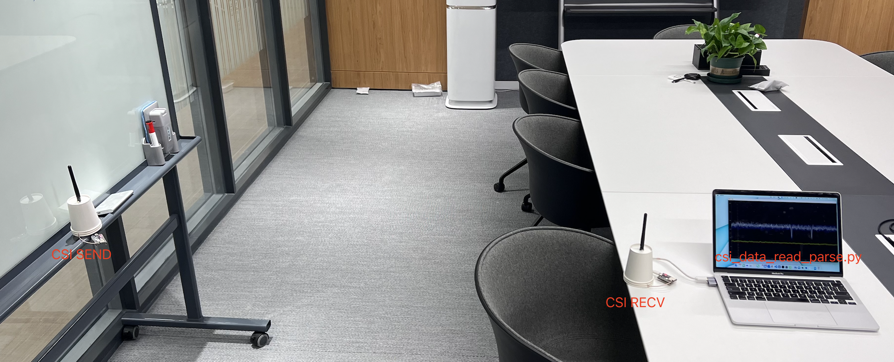
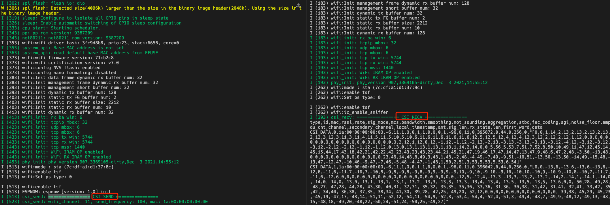

# Get Started Examples
This example demonstrates how to obtain CSI data through communication between two espressif chips, and uses a graphical interface to display real-time data of CSI subcarriers

## hardware

You need to prepare two development boards for espressif chips, one as the sender and the other as the receiver



In order to ensure the perception effect of CSI, please do your best to meet the following requirements
1. Use ESP32-C3 / ESP32-S3: ESP32-C3 / ESP32-S3 is the best RF chip at present
2. Use an external antenna: PCB antenna has poor directivity and is easily interfered by the motherboard
3. The distance between the two devices is more than one meter

##Binding


1. Burn the firmware of `csi_recv` and `csi_send` on two development boards respectively

    

    ```shell
    # csi_send
    cd esp-csi/examples/get-started/csi_send
    idf.py set-target esp32c3
    idf.py flash -b 921600 -p /dev/ttyUSB0 monitor

    # csi_recv
    cd esp-csi/examples/get-started/csi_recv
    idf.py set-target esp32c3
    idf.py flash -b 921600 -p /dev/ttyUSB1
    ```

2. Run `csi_data_read_parse.py` in `csi_recv` for data analysis, Please close `idf.py monitor` before running

    ```shell
    cd esp-csi-gitlab/examples/get-started/tools

    # Install python related dependencies
    pip install -r requirements.txt

    # Graphical display
    python csi_data_read_parse.py -p /dev/ttyUSB1
    ```

## A&Q

### 1. `csi_send` prints no memory
- **Phenomenon**: The following log appears on the serial port:
  ```shell
    W (510693) csi_send: <ESP_ERR_ESPNOW_NO_MEM> ESP-NOW send error
  ````
- **Reason**: The current channel is congested causing congestion in sending packets, so that the ESP-NOW buffer space is full
- **Solution**: Change the Wi-Fi channel or change to a place with a better network environment

### 2. `csi_data_read_parse.py` Serial port printing exception
- **Phenomenon**: The following log appears on the serial port:
    ```shell
        element number is not equal
        data is not incomplete
    ````
- **Reason**: PYQT takes up a lot of CPU when drawing, causing the PC to be unable to read the serial port buffer queue in time, resulting in data confusion
- **Solution**: Advance the baud rate of the serial port

### 3. Interface changes slowly
- **Phenomenon**: CSI display interface does not update at 100Hz
- **Reason**: Improper use of the function during PYQT5 processing
- **Solved**: After zooming in and out, the interface will return to normal. If you find the cause of the bug, please report it